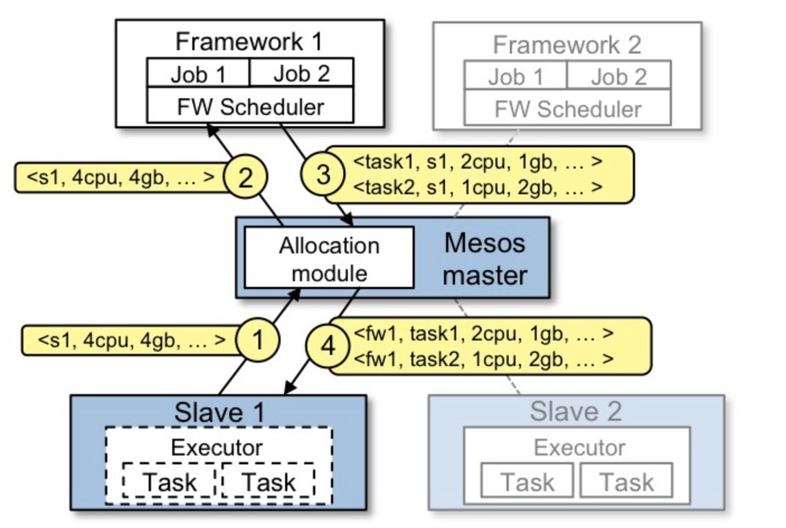
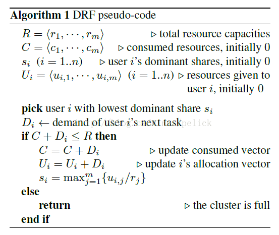
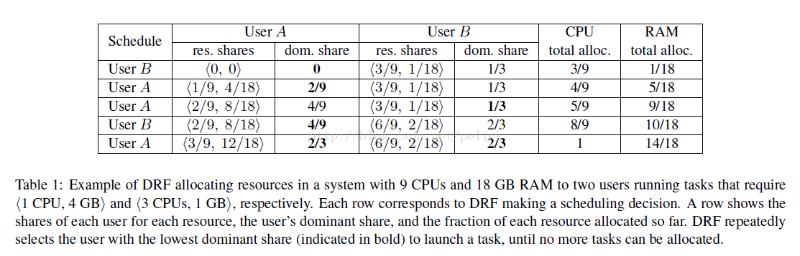

Report for Assignment 2
----
## 一、Mesos 的组成结构

Mesos 架构主要分为三部分：Master, Agent, Frameworks. 其中 Frameworks 又可以被分为 Scheduler 和 Executor. 各个部分之间的关联结构如论文中插图所示：


### master
master 代码位于 /src/master 目录下。
master 在 Mesos 架构中居于核心位置。master 负责管理每一个集群节点上运行的 agent 守护进程，以及 agent 上执行具体任务的 frameworks.
master 进行对 agent 的管理的重要手段是统筹管理集群资源。master 利用 resource offer 机制实现这一点。resource offer 记录每个节点上有哪些处于空闲状态的资源（包括 CPU、内存、磁盘、网络等），资源列表的维护和更新由 master 完成。master 会根据这一列表中的信息、利用某种分配策略决定下一步为各个节点分配哪些资源。
<br><br>
master 的资源分配机制可能需要根据不同运行状况和节点需求而有所改变。为了适应多种分配机制的需求，master 使用了一种模块化的体系结构来使得添加新的分配策略变得更为容易。
<br><br>
在实际应用中，常常会有多个 master 同时存在的情况，它们互为备份，防止由于某一个 master 终止运行造成整个系统意外停止。Mesos 使用 Zookeeper 管理多个 master，并选择其中一个作为主节点执行各项功能。
### agent
agent 在一些旧的文档中被称为 slave，代码位于 `/src/sched` 和 `/src/slave` 目录下。
<br><br>
agent 一方面向处于运行状态的 master 报告目前节点上的空闲资源，从而更新 resource offer 的资源列表，另一方面接收 master 关于分配资源和执行任务的指令，将资源分配给具体 framework 的 executor.
### frameworks
frameworks 分为 scheduler 和 executor 两部分，负责具体执行某一个任务时的资源调度和执行工作，代码分别位于 `/src/scheduler` 和 `/src/executor` 目录下。
scheduler 负责与 master 交流目前 framework 运行需要哪些资源，以及 master 能够提供哪些资源。scheduler 向 master 注册框架信息后，master 会不断告知 scheduler 目前有哪些资源可用，由 scheduler 决定是否接受。若是，scheduler 还需要在接收资源并在节点内部进行分配后，告知 master 各项资源的具体分配信息。
<br><br>
executor 负责在接收资源后具体执行任务。新的框架加入集群时也需要 executor 启动框架。
### Zookeeper
Zookeeper 是一个 Apache 顶级项目。它是一个针对大型应用的数据管理、提供应用程序协调服务的分布式服务框架，提供的功能包括：配置维护、统一命名服务、状态同步服务、集群管理等。在生产环境中， Zookeeper 能够通过同时监控多个 master 在前台或后台运行或挂起，为 Mesos 提供一致性服务。
<br><br>
代码位于 `/src/zookeeper` 目录下。
### 工作流程
1. master 监控各个 agent 运行情况，不断更新资源列表，用 resource offer 向各个 scheduler 提供资源 offer.
2. agent 每隔一段时间向 master 更新可用资源情况。
4. framework 接收用户的任务请求，接受 master 提供的资源 offer, 并告知 master 需要每个任务具体需要多少资源. master 采用某种调度算法为该 framework 分配一定的资源。
0. 得到资源后，agent 调用 executor 执行各个任务，并继续向 master 报告有多少资源可用。
## 二、框架在 Mesos 上的运行过程
以 Spark on Mesos 为例。

<br><br>
大致运行架构如上图。Mesos master 代替 Cluster Manager 负责节点资源监控和资源列表更新工作。在 Mesos 接收用户提交的任务请求后，会将任务分配给集群中的一些工作节点执行。Spark 启动后，首先由 scheduler 向 master 注册，之后若收到了 master 分配的任务，则由 scheduler 根据 master 在 resource offer 中提供的资源情况，在框架内部进行调度，并将资源调度结果和剩余的空闲资源信息返回给 master，最后由 master 调度 executor 来执行任务。
### 与在传统操作系统上运行程序对比
相似点：
+ 都要对任务的具体执行单元提供抽象的资源信息。
+ 都涉及多个任务共同执行时，资源的分配和调度问题。
<br><br>
不同点：
+ 运行环境不同：传统操作系统运行在一个工作节点上，而 Mesos 需要同时控制多个工作节点，这种结构性的差异导致 Mesos 必须设计一系列完全不同于传统操作系统的结构（如 master 和 agent 各自的功能、模块化的调度策略等）来适应用户需求。
+ 资源分配时的决定主体不同：传统操作系统中一般在系统分配资源后就默认被接收，而 Mesos 中由框架的 scheduler 决定是否接收。
+ 监管者的数量不同：传统操作系统由单一的操作系统进程管理全部系统资源，如果这一进程被意外杀死则整个系统崩溃；Mesos 利用 Zookeeper 管理多个 master，如果前台 master 运行出现问题，将启用后台的 master 代替。这也是由于集群崩溃的代价远大于单一节点崩溃的代价而作出的专门性调整。
## 三、master 和 slave 的初始化过程
### master 初始化
#### 1. 解析命令行参数
`/src/master/main.cpp`中的 `main()` 函数提供了 master 初始化的功能。

首先，在第 218-275 行，利用 Google gflags 包解析命令行参数并设置环境变量：
```
  if (flags.advertise_ip.isSome()) {
    os::setenv("LIBPROCESS_ADVERTISE_IP", flags.advertise_ip.get());
  }
```
这段代码即是通过 `advertise_ip` 参数来设置环境变量 `LIBPROCESS_ADVERTISE_IP`。
#### 2. 处理并输出 build 信息
277-306 行，输出 master 的版本号、build 信息、warning 信息等。
#### 3. 初始化libprocess库
调用 `process::initialize()` 函数。
#### 4. 初始化防火墙和模块信息
310-364 行，设置防火墙禁用的 endpoint，并再一次读取命令行参数，调用 `ModuleManager::load()` 函数加载模块，再创建匿名模块。
#### 5. 初始化 hooks
366-372 行，用于在 master 初始化完成之后的某些情境内代替正常的节点返回值。
#### 6. 初始化 allocator 并创建实例
374-382 行，调用 `Allocator::create()` 完成。
#### 7. 初始化与注册相关的其他实例
376-560 行，设置注册信息存储空间、状态信息等事项。
#### 8. 启动 master 线程
562-577 行，创建 master 实例，监听消息并开始执行 master.
### agent 初始化
`/src/slave/main.cpp` 中的 `main()` 函数提供了 agent 初始化的功能。其中一部分功能与 master 启动过程基本一致，这里只列举有所区别的部分。
#### 1. 初始化 fcher 和 containerizer
493-509 行，二者均用于创建 agent 的运行环境。
#### 2. 创建 master dectector
511 行，用于初始监测并联系 master.
#### 3. 创建 authorizer 和 gc
513-548 行，负责监测和回收资源。
## 四、Mesos 的资源调度算法
算法的主要部分位于 `/src/master/allocator/mesos/hierarchical.cpp`，使用主导资源公平算法 (DRF) 算法进行默认资源调度。DRF 算法是一种支持多资源的最大-最小公平分配机制，它定义了每个用户请求资源中的主导性资源（请求量占系统提供总资源量比重最大的一种资源），并以主导型资源为基准，尽量使每个用户分配到的资源中，主导性资源占比相等或接近。

论文 "Dominant Resource Fairness: Fair Allocation of Multiple Resource Types" 中较为详细的阐述了 DRF 算法的设计思想，其中举了一个例子演示 DRF 算法的运行过程：
>考虑一个有 9 个 CPU 和 18 GB 的系统，有两个用户：用户 A 的每个任务都请求 (1 CPU, 4 GB) 资源；用户 B 的每个任务都请求 (3 CPU, 4 GB) 资源。如何为这种情况构建一个公平分配策略？
>
>根据 DRF 算法的思想，可以解得给用户 A 分配 3 份资源，用户 B 分配 2 份资源是一个很好的选择。算法伪代码为：
>
>
>
>分配过程如下表所示，注意，每一次选择为哪个资源分配的决定，取决于上次分配之后，目前 dominant share 最小的那个用户可以得到下一次的资源分配。
>
>
>
>在这个例子中，用户 A 的 CPU 占总 CPU 1/9，MEM 占总 MEM 的 2/9，而用户 B 的 CPU 占 1/3，MEM占 2/9，所以 A 的主资源为内存，B 的主资源为 CPU。基于这点，DRF 会最大化 A 的内存的最小化分配，并会最大化 B 的 CPU 的最小分配。

DRF 算法的优点在于，提供了一种在多用户申请多种有限资源时较为公平的进行分配的方案。DRF 算法可以规避某一个框架大量占用某项资源导致剩余该项资源无法供给任务使用，从而造成资源的浪费。
## 五、简单工作的框架
参考豆瓣的 `pymesos` 框架，通过修改该框架 `example` 中的 `scheduler.py` 和 `executor.py` 代码，验证大数定律。

在 `executor.py` 中，通过 `random()` 函数每次产生一个介于 0 和 1 之间的伪随机数，若落在 0.1 与 0.2 之间，则计数加一，最后统计计数与总运行次数之比。每次运行产生随机数 1000000 次，共运行 `executor.py` 15 次。

在 `scheduler.py` 中，对每次 `executor.py` 返回的计算结果相加，满 15 次后取平均值输出。

与 `pymesos` 样例程序相比较，主要在以下代码段作出了扩充：
```
# scheduler.py
class dice(Scheduler):
    total_prob = 0
    counter = 15
    tmp = 0

    def __init__(self, executor):
        self.executor = executor

    def frameworkMessage(self, driver, executorId, slaveId, message):
        self.total_prob = self.total_prob + float(decode_data(message))
        self.tmp = self.tmp + 1
        if self.tmp >= self.counter:
            self.total_prob = self.total_prob/self.counter
            print(self.total_prob)
            driver.stop()
```

```
#executor.py
            N = 1000000
	    count = 0
            for i in range(N):  
                x = random()
                if x >= 0.1:  
			if x < 0.2:                
				count += 1  
            prob = count / N 
            print(prob)
            driver.sendFrameworkMessage(encode_data(str(prob)))
 ```
 
程序运行结果和后台监测情况、资源使用状况：


