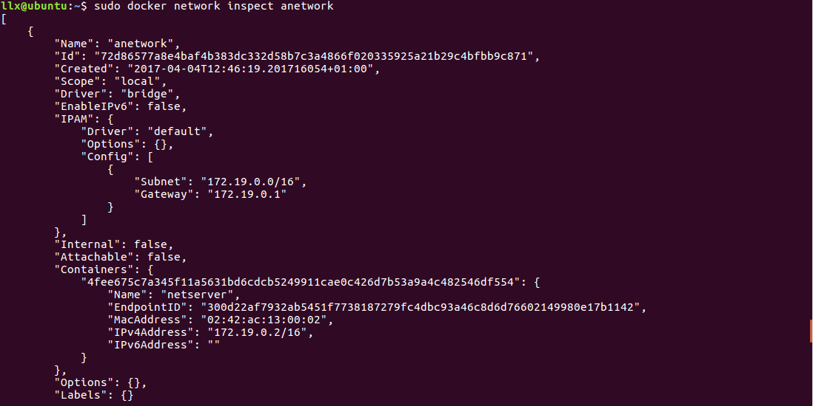
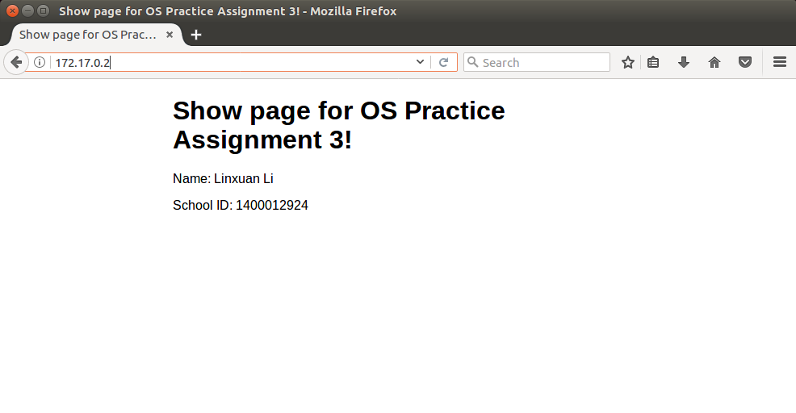
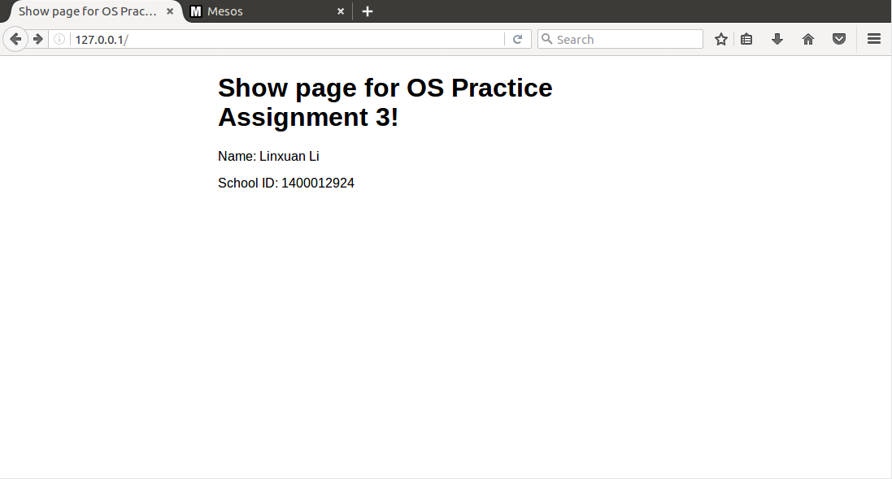

Report for Assignment 3
----
## 一、Docker 的安装和配置
按照 Docker 网站说明在 Ubuntu 系统中安装了 Docker Community Edition for Ubuntu, 安装成功后运行 Hello-world 测试程序结果如下：


## 二、Docker 基本命令介绍
### 1. 镜像管理命令 images

**含义**

列出机器上的镜像

**用法**

```
docker images [OPTIONS] [REPOSITORY[:TAG]]
```
在本机执行的结果：
<br><br>
**选项**

| 名字和缩写 | 缺省值 | 描述
| ------| ------ | ------ |
--all, -a | false | Show all images (default hides intermediate images)
--digests | false | Show digests
--filter, -f | | Filter output based on conditions provided
--format | | Pretty-print images using a Go template
--no-trunc | false | Don’t truncate output
--quiet, -q | false | Only show numeric IDs

**例子**
```
$ docker images java:8
```
打印所有位于```java```仓库中且带有标记```8```的镜像
<br><br>
```
$ docker images --filter "label=com.example.version=1.0"
```
打印所有带有标记```com.example.version```且值为```1.0```的镜像

### 2. 容器管理命令 run

**含义**

在特定镜像上创建一个新容器，并在其中运行一个命令。在这一过程中，Docker 在后台运行的标准操作包括：
+ 检查本地是否存在指定的镜像，若不存在则从公有仓库下载
+ 利用镜像创建并启动一个容器
+ 分配一个文件系统，并在只读的镜像层外面挂载一层可读写层
+ 从宿主主机配置的网桥接口中桥接一个虚拟接口到容器中去
+ 从地址池配置一个 ip 地址给容器
+ 执行用户指定的应用程序
+ 执行完毕后容器被终止

**用法**

```
docker run [OPTIONS] IMAGE [COMMAND] [ARG...]
```

**例子**

```
docker run -i -t --name mytest centos:centos6 /bin/bash
```

使用镜像创建容器并进入交互模式, login shell 为 /bin/bash. ```--name```参数指定启动后的容器名字，如果不指定则 Docker 会为其自行取一个名字。镜像 centos:centos6 也可以用 IMAGE ID 代替。选项```-i```保持标准输入接口开启，```-t```参数令 Docker 创建pseudo-TTY设备。pseudo-TTY 负责 client 与容器进程进行交互。

**相关命令**
```
docker ps [OPTIONS]
```
列出容器

```
docker start [OPTIONS] CONTAINER [CONTAINER...]
```
启动一个或多个已停止的容器

```
docker stop [OPTIONS] CONTAINER [CONTAINER...]
```
停止一个或多个运行中的容器

```
docker logs [OPTIONS] CONTAINER
```
取得容器日志

### 3. 网络管理命令 network
**含义**

管理网络，包括一系列子命令。

**用法**

```
docker network COMMAND
```

**子命令**

| 命令 | 描述 |
| ------| ------ |
```docker network connect``` | 将容器连接到网络
```docker network create``` | 创建一个网络
```docker network disconnect```	| 将容器与网络断开连接
```docker network inspect``` | 展示网络的细节信息
```docker network ls```	| 列出所有网络
```docker network prune``` | 移除所有未被使用的网络
```docker network rm```	| 移除一个或多个网络

**例子**
```
docker network create -d bridge bridge-network 
```
用 bridge 网络驱动创建一个名为 bridge-network 的网络。

```
docker network ls -q 
```
打印所有网络的 ID. （```-q```参数表示仅打印网络 ID ）

### 4. docker version
**含义**

显示 docker 版本信息

**用法**

```docker version [OPTIONS]```

**选项**

```--format, -f  Format the output using the given Go template```

**例子**

```$ docker version --format '{{.Server.Version}}'```
显示服务器版本

### 5. docker search
**含义**

在  Docker Hub 搜索镜像

**用法**

```docker search [OPTIONS] TERM```

**例子**

```
docker search busybox
```
显示所有名字含有```busybox```的镜像的信息

## 三、nginx 服务器和 network 配置
### 1. 创建一个基础镜像为 ubuntu 的 docker 镜像
```
sudo docker run -i -t --name assignment3 -p 9999:80 ubuntu /bin/bash
```
设置容器名称为```assignment3```，将容器的 80 端口映射到 host 9999 端口。执行命令后系统会自动 pull 缺少的```ubuntu:latest```.

完成后终端状态如下：

### 2. 加入 nginx 服务器

```
apt update
apt install nginx -y
apt install vim
nginx
```
安装 nginx 并启动，同时为了便于后续文本操作，在容器中安装了 vim.

### 3. 编辑 web 服务器主页
```
cd /var/www/html/
vim index.nginx-debian.html
```
修改服务器主页，显示姓名和学号。

修改完成后，从主机访问 127.0.0.1:9999, 显示如下页面：

### 4. 利用 tail 命令将访问日志输出到标准输出流
```
tail -f /var/log/nginx/access.log
```
输出结果如下：


### 5. 创建一个自己定义的 network
```
exit
sudo docker commit assignment3 netimage
sudo docker run -d --name netserver -p 9999:80 netimage nginx -g 'daemon off;'
```
退出容器，保存镜像并创建新容器以运行新镜像。

```
sudo docker network create anetwork
sudo docker network connect anetwork netserver
sudo docker network inspect anetwork
```
创建自己定义的 network，并连入网络，检查 network 信息。

network 信息如下：



### 6. host 访问网站

```
sudo docker inspect netserver
```
获取网站 IP 地址，为```127.17.0.2```.

浏览器访问结果如下：



## 四、网络模式
### null

这一模式将容器放置在它自己的网络栈中，但是不进行任何配置。实际上，null 模式关闭了容器的网络功能，在以下情况下可以应用这一模式：
1. 容器并不需要 network 时（例如只需要写磁盘卷的批处理任务）。
2. 用户希望自定义网络时。
可以通过以下命令启动 null 模式的 container:
```
docker run -it --network none ubuntu /bin/bash
```
同时，网络管理指令不能断开 null 模式的网络。

### bridge
在这一模式中，docker 守护进程创建了一个虚拟以太网桥 docker0，附加在其上的任何网卡之间都能自动转发数据包。默认情况下，守护进程会创建一对对等接口，将其中一个接口设置为容器的 eth0 接口，另一个接口放置在宿主机的命名空间中，从而将宿主机上的所有容器都连接到这个内部网络上。同时，守护进程还会从网桥的私有地址空间中分配一个 IP 地址和子网给该容器。

通过以下命令启动 bridge 模式的 container:
```
docker run -i -t mysql:latest /bin/bash
docker run -i -t --net="bridge" mysql:latest /bin/bash
```
容器可以加入多个 bridge 网络。通过```docker network connect```或```docker network disconnect```来自由连接或断开 bridge 网络。

### host
这一模式中，将禁用 docker 容器的网络隔离。因为容器共享了宿主机的网络命名空间，将其直接暴露在公共网络中。因此，需要通过 port mapping 来进行协调。

host 模式的优点在于，容器可以直接使用宿主机的 IP 地址与外界通信，同时容器内服务的端口也可以使用宿主机的端口，无需进行额外的 NAT 转换。 但是容器不再拥有隔离、独立的网络栈也带来了一些问题。 另外，host 模式的容器虽然可以令其内部的服务和传统情况无差别、无改造的使用，但是由于网络隔离性的弱化，该容器会与宿主机共享竞争网络栈的使用；另外，容器内部将不再拥有所有的端口资源，因为部分端口资源可能已经被宿主机本身的服务占用。

通过以下命令启动 host 模式的 container:
```
docker run -it --network host ubuntu /bin/bash。
```

### overlay
这一模式使用 docker 内置的 swarm 来管理结点，首先在第一台主机上输入```docker swarm init```，便会创建一个 swarm 的管理结点。 之后在其他主机上输入```docker swarm join```，即可将它们加入 worker 之中，在第一台主机可以通过```docker node ls```查看这些 worker. 

overlay 模式主要用于 docker 服务和集群的创建。相比于只能在本地网络中访问的模式，overlay网络通过一个新的网段来管理一个集群，通过注册的方式来发现新结点，避免了普通模式下跨主机通讯的繁琐过程。

## 五、mesos 与 docker 的交互

代码位于```mesos-1.1.0/src/docker```文件夹中。
### docker.cpp
docker.hpp 头文件中定义了 Docker 类，该类内部又定义了 Container 和 Image 两个类。```docker.cpp``` 封装了一些 docker 使用的 API，比较重要的包括：

```create```创建容器或者创建镜像

```run```运行docker

```stop```停止运行 docker

```kill```杀死docker

```rm```删除docker

### executor.cpp
实现了 mesos framework 的一个 executor, 调用```docker.cpp```中的一系列 API 管理 docker.

### spec.cpp
负责解析 JSON 格式的 INFO 信息。

### run 函数

1. 检查docker info 是否存在并获取 docker info：
```
if (!containerInfo.has_docker()) {
    return Failure("No docker info found in container info");
  }
  
const ContainerInfo::DockerInfo& dockerInfo = containerInfo.docker();
```
2. 添加命令行参数
```
vector<string> argv;
argv.push_back(path);
argv.push_back("-H");
argv.push_back(socket);
argv.push_back("run");

if (dockerInfo.privileged()) {
    argv.push_back("--privileged");
  }
```
3. 分配 CPU 资源，并添加环境变量
```
  if (resources.isSome()) {
    // TODO(yifan): Support other resources (e.g. disk).
    Option<double> cpus = resources.get().cpus();
    if (cpus.isSome()) {
      uint64_t cpuShare =
        std::max((uint64_t) (CPU_SHARES_PER_CPU * cpus.get()), MIN_CPU_SHARES);
      argv.push_back("--cpu-shares");
      argv.push_back(stringify(cpuShare));
    }

    Option<Bytes> mem = resources.get().mem();
    if (mem.isSome()) {
      Bytes memLimit = std::max(mem.get(), MIN_MEMORY);
      argv.push_back("--memory");
      argv.push_back(stringify(memLimit.bytes()));
    }
  }

  if (env.isSome()) {
    foreachpair (string key, string value, env.get()) {
      argv.push_back("-e");
      argv.push_back(key + "=" + value);
    }
  }
  
...

argv.push_back("-e");
  argv.push_back("MESOS_SANDBOX=" + mappedDirectory);
  argv.push_back("-e");
  argv.push_back("MESOS_CONTAINER_NAME=" + name);
```
4. 检查磁盘挂载信息，设置命令行参数。
```
Option<string> volumeDriver;
  foreach (const Volume& volume, containerInfo.volumes()) {
  
  ...
  
  }
```
5. ```--net```网络配置，```sandbox```目录映射到```mapped```
```
argv.push_back("-v");
  argv.push_back(sandboxDirectory + ":" + mappedDirectory);

  // TODO(gyliu513): Deprecate this after the release cycle of 1.0.
  // It will be replaced by Volume.Source.DockerVolume.driver.
  if (dockerInfo.has_volume_driver()) {
    if (volumeDriver.isSome() &&
        volumeDriver.get() != dockerInfo.volume_driver()) {
      return Failure("Only one volume driver per task is supported");
    }

    volumeDriver = dockerInfo.volume_driver();
  }

  if (volumeDriver.isSome()) {
    argv.push_back("--volume-driver=" + volumeDriver.get());
  }

  const string& image = dockerInfo.image();

argv.push_back("--net");
string network;
switch (dockerInfo.network()) {
    ...
}
argv.push_back(network);
```
6. 检查和重写 entrypoint
```
if (commandInfo.shell()) {
    argv.push_back("--entrypoint");
    argv.push_back("/bin/sh");
}
```
7. 添加容器名和指定镜像名
```
argv.push_back("--name");
argv.push_back(name);
argv.push_back(image);
```
8. 添加运行容器后的命令和参数
```
if (commandInfo.shell()) {
    if (!commandInfo.has_value()) {
      return Failure("Shell specified but no command value provided");
    }

    // Adding -c here because Docker cli only supports a single word
    // for overriding entrypoint, so adding the -c flag for /bin/sh
    // as part of the command.
    argv.push_back("-c");
    argv.push_back(commandInfo.value());
  } else {
    if (commandInfo.has_value()) {
      argv.push_back(commandInfo.value());
    }

    foreach (const string& argument, commandInfo.arguments()) {
      argv.push_back(argument);
    }
  }

  string cmd = strings::join(" ", argv);

  LOG(INFO) << "Running " << cmd;

  map<string, string> environment = os::environment();

  // NOTE: This is non-relevant to pick up a docker config file,
  // which is necessary for private registry.
  environment["HOME"] = sandboxDirectory;
```
9. 运行容器
```
Try<Subprocess> s = subprocess(
      path,
      argv,
      Subprocess::PATH("/dev/null"),
      _stdout,
      _stderr,
      nullptr,
      environment);
```
## 六、编写 framework，以容器的方式运行 task

使用豆瓣提供的```pymesos```框架，在本任务中只需要编写 scheduler 即可。主要完成了 docker, container, task 等的基本属性设定和启动工作，见以下部分：
```
			#information of container
			ContainerInfo = Dict()
			ContainerInfo.type = 'DOCKER'
			ContainerInfo.docker = DockerInfo

			#information of docker
			DockerInfo = Dict()
			DockerInfo.image = 'netimage'
			DockerInfo.network = 'HOST'

			#information of nginx command
			CommandInfo = Dict()
			CommandInfo.shell = False
			CommandInfo.value = 'nginx'
			CommandInfo.arguments = ['-g', "'daemon off;'"]

			#set the task
			task = Dict()
			task_id = str(uuid.uuid4())
			task.task_id.value = task_id
			task.agent_id.value = offer.agent_id.value
			task.name = 'nginx'
			task.container = ContainerInfo
			task.command = CommandInfo

			task.resources = [
				dict(name='cpu', type='SCALAR', scalar={'value': TASK_CPU}),
				dict(name='mem', type='SCALAR', scalar={'value': TASK_MEM}),
			]

			#launch the task
			driver.launchTasks(offer.id, [task], filters)
```

运行时，```mesos agent```启动命令需要加上如下命令以支持 docker 的运行：
```--containerizers=docker,mesos \
--image_providers=docker --isolation=docker/runtime
```

运行 framework 后访问结果如下：

