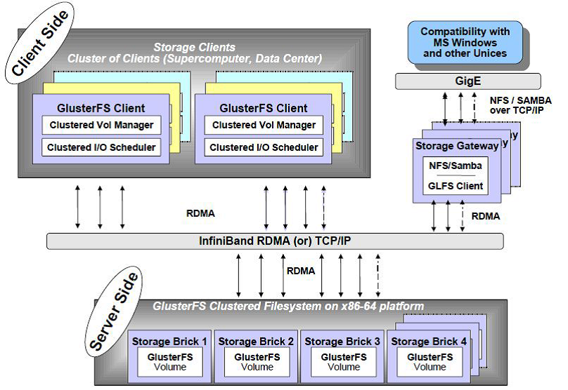
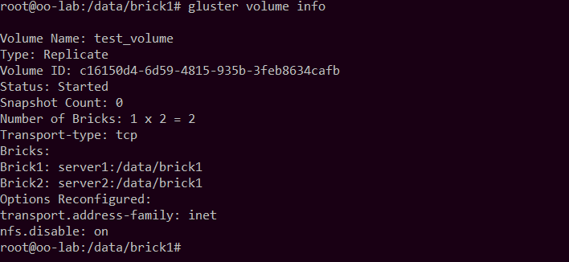
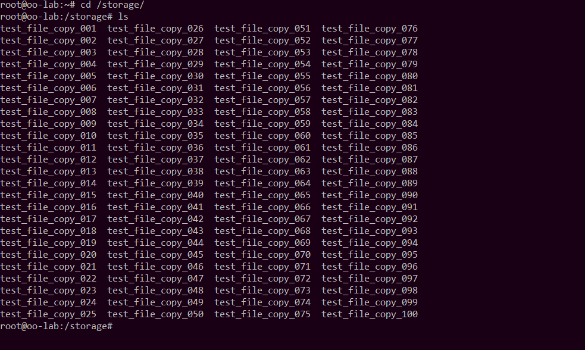
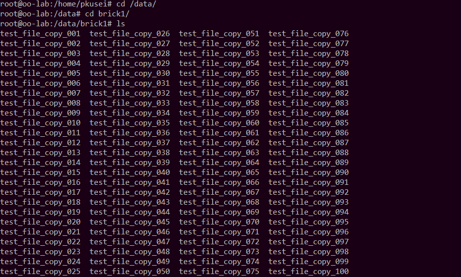
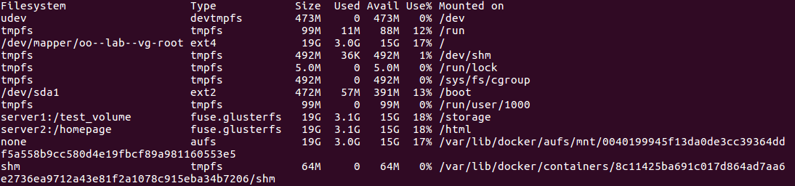

Report for Assignment 4
----

# 一、文件系统调研

## 分布式文件系统

### 1. GlusterFS

GlusterFS 是一款开源的分布式文件系统。目前主要应用于云计算、内容传播网络和流媒体服务领域。它通过以太网或 Infiniband RDMA 互连将各种存储服务器集成到同一个大型并行网络文件系统中。

#### 重要术语介绍

Brick：存储砖，GFS 中的存储单元，是一个受信存储池中的服务器的一个导出目录。可以通过主机名和目录名来标识，如 ’SERVER:EXPORT'

Client：挂载了 GFS 卷的设备

FUSE（Filesystem in Userspace）：是一个可加载的 Unix 内核模块，支持非特权用户创建自己的文件系统而不需要修改内核代码。通过在用户空间运行文件系统的代码与内核进行桥接

GFID：GFS卷中的每个文件或目录都有一个唯一的 128 位的数据相关联，用于模拟 inode

Namespace：每个 Gluster 卷都导出单个 namespace 作为 POSIX 的挂载点

Node：一个拥有若干 brick 的设备

Volume：一组 bricks 的逻辑集合

RDMA：远程直接内存访问，支持不通过双方的操作系统进行直接内存访问

RRDNS（round robin DNS）：一种通过 DNS 轮转返回不同的设备以进行负载均衡的方法

Self-heal：用于后台运行检测复本卷中文件和目录的不一致性并解决这些不一致。

Split-brain：脑裂

Volfile：GlusterFS 进程的配置文件，通常位于 ```/var/lib/glusterd/vols/volname```

#### 工作原理

GlusterFS 总体架构如下图所示：



GlusterFS 主要由存储服务器（BrickServer）、客户端以及 NFS/Samba 存储网关组成。从架构图可以看出 GlusterFS 中没有元数据服务器组件，这是一个重要的设计关键点，对于提升整个系统的性能、可靠性和稳定性都有着决定性的意义。GlusterFS 支持 TCP/IP 和 InfiniBand RDMA 高速网络互联，客户端可通过原生 Glusterfs 协议访问数据，其他没有运行 GlusterFS 客户端的终端可通过 NFS/CIFS 标准协议通过存储网关访问数据。

工作流程如图所示：


1. 在服务器端，每台服务器上运行 GlusterFs，将本地文件系统的一部分暴露给用户。
2. 在客户端， 用户通过 GlusterFS 的 mount point 操作来读写数据， 对于用户来说，集群系统的存在对用户是完全透明的，用户感觉不到是操作本地系统还是远端的集群系统。
3. 用户的操作请求被递交给本地 Linux 系统的 VFS 来处理。
4. VFS 将数据递交给 FUSE 内核文件系统。
5. client 对数据进行一些指定的处理。
6. 在 client 的处理末端，通过网络将数据递交给 server，并将数据写入到服务器所控制的存储设备上。

#### 使用方式

GlusterFS 服务端安装：

```
yum -y install glusterfs glusterfs-server
chkconfig glusterd on
service glusterd start
```

基本操作：

```
$ gluster peer probe server2 # add server2 to the storage pool
$ gluster volume create gv0 replica 2 server1:/data/brick1/gv0 server2:/data/brick1/gv0 # create the copying volume 
$ gluster volume start gv0 # start the copying volume
$ mount -t glusterfs server1:/gv0 /mnt # mount the colume in clients
$ gluster volume info # see the information of a volume
$ gluster peer status # see the nodes' information
```

### 2. Hadoop 分布式文件系统（HDFS）

HDFS 是一种具有高度的容错能力的分布式文件系统，设计旨在部署于低成本的硬件设备上。HDFS 还提供对应用程序数据的高吞吐量访问，适用于具有大数据集的应用程序。

#### 工作原理

HDFS 将文件切分为多个 block 并分散存储与多个数据节点上。一个 HDFS 集群具有一个 NameNode 和多个数据节点，NameNode 用于存放全部数据的 metadata 并管理数据节点的文件访问操作。NameNode 还执行文件系统命名空间操作，如打开，关闭和重命名文件和目录。DataNodes 负责从文件系统的客户端提供读取和写入请求，它本身不具有所存储数据的详细信息。

整体架构图如下：


当用户访问文件时，客户端通过调用 open 方法打开被请求的的文件，调用 NameNode 获取文件块的位置信息，对于元文件存储的每一个块，NameNode 返回含有该块副本的 DataNode 的结点地址，并根据网络拓扑结构确定从最近的一个 DataNode 获取数据块的副本。读文件完成后，关闭连接。

在向 HDFS 写文件时，client 首先通过调用 create 方法创建文件，并由 NameNode做相应的常规检查检查，之后 NameNode 会为创建的文件写一条记录到本地磁盘的EditLog，否则向 client 抛出 IO 异常。创建成功之后HDFS会返回一个FSDataOutputStream对象，客户端由此开始写入数据。

#### 使用方式

可以通过 HDFS 提供的 Web 服务器接口进行访问，或在 shell 中操作。

在 Ubuntu 中使用以下命令安装：

```
$ sudo apt-get install ssh 
$ sudo apt-get install rsync
```

基本操作：

```
# 格式化一个新的分布式文件系统：
$ bin/hadoop namenode -format

# 启动Hadoop守护进程：
$ bin/start-all.sh

# 将输入文件拷贝到分布式文件系统：
$ bin/hadoop fs -put conf input

# 运行发行版提供的示例程序：
$ bin/hadoop jar hadoop-*-examples.jar grep input output 'dfs[a-z.]+'

# 将输出文件从分布式文件系统拷贝到本地文件系统查看：
$ bin/hadoop fs -get output output 
$ cat output/*

# 在分布式文件系统上查看输出文件：
$ bin/hadoop fs -cat output/*

# 完成全部操作后，停止守护进程：
$ bin/stop-all.sh
```

## 联合文件系统

### OverlayFS

OverlayFS 是一个面向 Linux 的文件系统服务，实现了一个面向其他文件系统的联合挂载。它的实现较简单，读写性能较好，并且稳定。可以充分利用 overlay 文件系统的 page cache。

#### 工作流程

OverlayFS 使用两个层，把一个目录置放于另一个之上，并且对外提供单个统一的视角。这种分层的技术被称作 union mount。下层的目录被称为 lowerdir，上层的为 upperdir。下图展示了 Docker 镜像和 Docker 容器在 OverlayFS 中是如何分层的：


在使用过程中，对于 upperdir 中存在的文件，OverlayFS 直接其提交给用户；而对于 upperdir 没有但 lowerdir 有的文件，则把 lowerdir 的提交给用户。在写入时，对 upperdir 的文件直接写入，对来自 lowerdir 的文件进行 CoW。另外，OverlayFS 会对合并之后的文件系统的文件列表做一个 cache，使得对全部文件基本信息的访问操作能够执行得更快。

#### 使用方式

```
mount -t overlay overlay -o lowerdir=/lower, upperdir=/upper, workdir=/work/merged
```

# 二、安装配置一种分布式文件系统

选择了 GlusterFS 作为测试系统。在提供的三台服务器中搭建 GlusterFS。具体步骤如下：

+ 参照 Gluster Docs 教程，在服务器 1000 和 1001 上安装 GlusterFS-server

  ```
  sudo su
  add-apt-repository ppa:gluster/glusterfs-3.10
  apt update
  apt install glusterfs-server
  ```

+ 在服务器 1002 上安装 GlusterFS-client

  ```
  sudo su
  add-apt-repository ppa:gluster/glusterfs-3.10
  apt update
  apt install glusterfs-client
  ```

+ 分别修改 1000 和 1001 的 ```/etc/hosts``` 文件，使得两套服务器能够互相侦听

  ```
  # for server 1000
  127.0.0.1       server1
  127.0.1.1       oo-lab.cs1cloud.internal        oo-lab
  172.16.6.218    server2

  # for server 1001
  127.0.0.1       server2
  127.0.1.1       oo-lab.cs1cloud.internal        oo-lab
  172.16.6.44		server1
  ```

  其中，server1 和 server2 的 IP 地址是通过在各自服务器上执行 ```ifconfig``` 命令获取的

+ 在两台服务器上分别确认能够互相侦听（以 server1 为例）

  ```
   gluster peer probe server2
  ```

  显示结果如下：

  

+ 在两台服务器上分别创建存储砖

  ```
  mkdir -p /data/brick1
  ```

+ 在 1000 上创建并启动 volume（force 选项目的是强制允许 GlusterFS 在 root 分区存储数据）

  ```
  gluster volume create volume1 replica 2 server1:/data/brick1 server2:/data/brick1 force
  gluster volume start volume1
  gluster volume info
  ```

  volume1 信息显示如下：

  

+ 配置 1002 的挂载点

  ```
  # rewrite /etc/hosts 
  127.0.0.1		localhost
  127.0.1.1       oo-lab.cs1cloud.internal        oo-lab
  172.16.6.44		server1
  172.16.6.218	server2
  ```

  ```
  # create the mount point and mount volume1
  mkdir -p /storage
  mount -t glusterfs server1:/volume1 /storage

  # create a test file
  vim /home/pkusei/test_file

  # store 100 copies of test_file in /storage
  for i in `seq -w 1 100`; do cp -rp /home/pkusei/test_file /storage/test_file_copy_$i; done
  ```

  分别在 1002 和 1000/1001 查看拷贝文件存储情况：

  

  

  1000 和 1001 ```/storage``` 目录下均存有相同的 100 份文件拷贝，在任何一台服务器挂掉时，另一台仍可正常工作。


# 三、在 docker 中挂载 GlusterFS

+ 在 1000 和 1001 上分别创建 brick2 目录作为 Web 服务器主页的存储砖

  ```
  mkdir -p /data/brick2
  ```

+ 在 1001 上创建 volume web_show_page，启动 volume

  ```
  gluster volume create web_show_page replica 2 server1:/data/brick2 server2:/data/brick2 force
  gluster volume start web_show_page
  ```

+ 在 client 上创建 mount point 将 web_show_page 挂载并创建主页的 html 文件

  ```
  mkdir -p /html
  mount -t glusterfs server2:/homepage /html
  # create index.nginx-debian.html 
  ```

+ 将 Assignment 3 中完成的 docker 镜像用 ```scp``` 命令传输至 1002，并加载，更改 ```/etc/nginx/sites-enabled/default``` 中的 root 路径为 ```/html``` 

  ```
  docker load < save.tar
  # change /etc/nginx/sites-enabled/default
  docker run -v /html:/html -p 4040:80 -d --name assignment3 as4 nginx -g 'daemon off;'
  ```

+ 修改 1002 的 4040 端口转发，即可从服务器 IP 地址的 4040 端口（http://162.105.174.38:4040/）访问主页

  

  # 完成一次镜像的制作

  ## docker 的镜像机制

  docker 镜像具有分层结构，包括 rootfs 和 bootfs 两个文件系统。

  + rootfs 主要包括 Linux 系统中的 ```/dev```、```/proc```、```/bin``` 等常规的目录和文件。


  + bootfs 主要包括 bootloader 和 kernel，其中 bootloader 的主要功能是引导和加载 kernel。

  镜像中每个层结构的文件都是静态的，在对镜像进行修改时，修改操作会被存在一层之中。同时，不同的镜像可以共享底层的数据，当一个镜像启动新容器时，镜像会在其层结构上面再加一层，并令容器在这一层进行读写操作。

  ## 制作镜像

  利用 Ubuntu 镜像创建容器并启动

  ```
  docker create -it --name assignment4_container ubuntu /bin/bash
  docker start -i assignment4_container
  ```

  在新的终端内查看系统中各个容器的挂载记录

  ```
  sudo su
  df -hT
  ```

  这里需要注意的是，如果此前启动了其他 docker 容器，需要先用 ```docker stop``` 命令使它们停止。之后显示挂载记录截图：

  

  对文件系统标识为 none 的记录，查看其文件系统结构

  ```
  cd /var/lib/docker/aufs/layers
  cat 0040199945f13da0de3cc39364ddf5a558b9cc580d4e19fbcf89a981160553e5
  ```

  得到文件系统层次结构

  ```
  0040199945f13da0de3cc39364ddf5a558b9cc580d4e19fbcf89a981160553e5-init
  224b05bde06843f08071e4d8f3be95253e56eb923eca01931ff6e03526e78839
  b8c86b22b60d1a7235d2c53f6eb53c382865669622c38bdb621ed6c355c9f47e
  dd7388470fb0a5991fb700c098381ff24c6e55e8f97b569ea08d8c1cf2150211
  4315d67bb0bd296cf30a995ffca1e59e1e5c4691935daafdf447e124c4e2973d
  0e399e82f3b3e83573f6ba9f2b0a6480e5695888aa87bde47945e361d49d94cd
  ```

  由于在对运行中的容器进行操作时，不会使 -init 以外的层被更改，可以先将它们拷贝出来，存放在新建的目录中：

  ```
  mkdir /home/pkusei/assignment4_image
  cp -r 0e399e82f3b3e83573f6ba9f2b0a6480e5695888aa87bde47945e361d49d94cd /home/pkusei/assignment4_image/0
  cp -r 4315d67bb0bd296cf30a995ffca1e59e1e5c4691935daafdf447e124c4e2973d /home/pkusei/assignment4_image/1
  cp -r dd7388470fb0a5991fb700c098381ff24c6e55e8f97b569ea08d8c1cf2150211 /home/pkusei/assignment4_image/2
  cp -r b8c86b22b60d1a7235d2c53f6eb53c382865669622c38bdb621ed6c355c9f47e /home/pkusei/assignment4_image/3
  cp -r 224b05bde06843f08071e4d8f3be95253e56eb923eca01931ff6e03526e78839 /home/pkusei/assignment4_image/4
  ```

  在运行中的容器内安装 ```vim``` 和 ```Python3``` 

  ```
  apt update
  apt install vim
  apt install python3
  ```

  将容器最上一层文件结构拷贝

  ```
  cp -r 0040199945f13da0de3cc39364ddf5a558b9cc580d4e19fbcf89a981160553e5 /home/pkusei/assignment4_image/5
  ```

  按序挂载文件系统的拷贝

  ```
  mkdir /home/pkusei/assignment_mount
  mount -t aufs -o br=/home/pkusei/assignment4_image/5=ro:/home/pkusei/assignment4_image/4=ro:/home/pkusei/assignment4_image/3=ro:/home/pkusei/assignment4_image/2=ro:/home/pkusei/assignment4_image/1=ro:/home/pkusei/assignment4_image/0=ro none /home/pkusei/assignment4_mount
  ```

  在挂载点创建新镜像，并启动

  ```
  cd /home/pkusei/assignment4_mount
  tar -c . | docker import - assignment4_images
  docker run -it --name assignment4_container2 assignment4_image /bin/bash
  ```

  可以在新容器中使用 ```vim``` 和 ```Python3``` 了。

  ​

  ​

  ​

  ​

