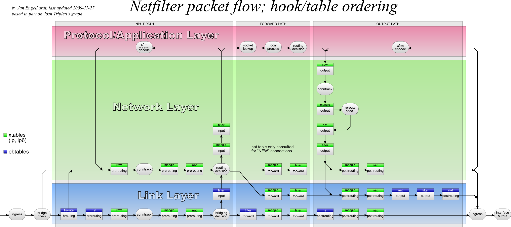
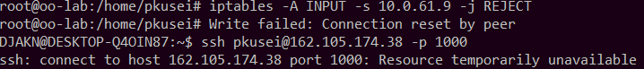
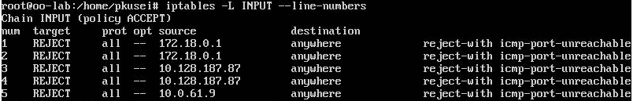
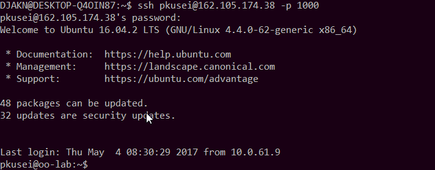
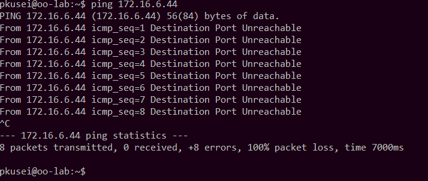
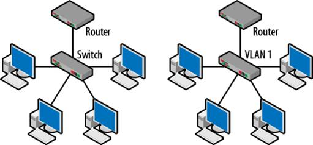
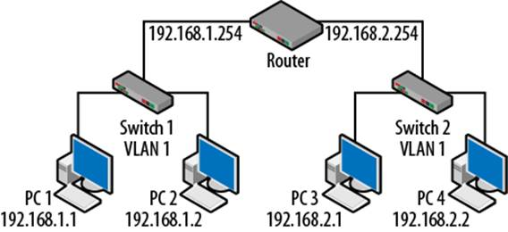
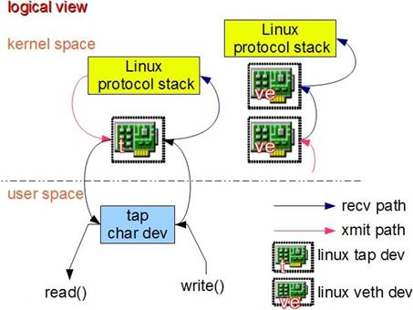
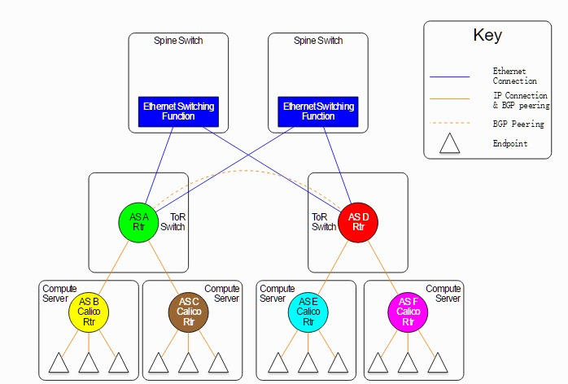
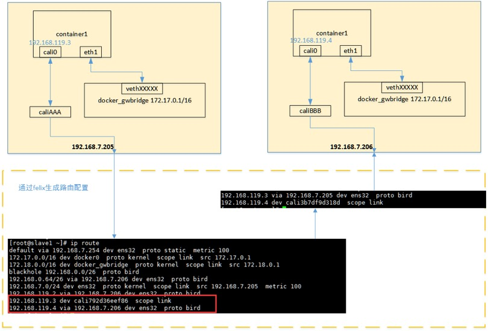

Report for Assignment 5
----

# 一、 Linux 内核如何对 IP 数据包进行处理

Linux 系统包括两个重要的处理网络数据包的工具，分别为 netfilter 和 iptables。其中，netfilter 是 Linux 内核中的一个软件框架，在内核态提供数据包过滤、内容修改等功能；netfilter 向用户态暴露了一些接口，用户态程序可以通过它们来控制内核的包路由规则。其中，iptables 就是一个为用户提供 IP 数据包管理功能的用户态程序。

对于 netfilter，它能够挂载在内核中，允许其他内核模块利用网络堆栈注册回调函数，之后，对于每一个经过堆栈中相应挂在组件的数据包，这些回调函数都会被自动调用，从而实现其特定功能。netfilter 对数据包的处理过程如下图所示：



对于 iptables，它为系统管理员提供了“表（tables）”、“链（chain）”和“规则（rules）”三种数据结构来处理数据包的运送流程。每一个网络数据包从抵达到离开该电脑至少会经过一个链，而一条规则可以决定是否将数据包送往下一条链（或执行其它的动作），这个处理可以在嵌套的结构里面重复使用。

数据包刚进入路由时，由数据包的来源决定它该穿过哪一个链。iptables的架构预先在过滤器（filter）里定义了三个键：INPUT（输入）、OUTPUT（输出）和FORWARD（转发）。预先定义的链也有一个默认的“policy”（政策），让数据包在历经规则到最后仍没有匹配的项目时，可以使用这个政策来进行操作。系统管理员可以视需要新增其它的链。这些链没有默认的策略可以处理。如果一个数据包到了这些链的最后仍然没有匹配的项目，就会回到前一个调用它的链。一个链也可以是空白的。

当一个数据包穿过一个链时，该链的每个规则会依序检查它。如果规则与数据包内容产生冲突，则这个数据包会被传递到下一个规则计算，如果与规则匹配，就会开始运行规则里由 target 制定的动作，这个动作会决定这个数据包要不要在这个链中继续被处理。这一过程可能发生在 OSI 模型的任何一层。

数据包会一直遍历链网，直到下述的任一条件被满足：

1. 某一个规则与数据包匹配，且它决定了这个数据包的最终去向。例如，规则调用了 ```ACCEPT``` 或 ```DROP``` 。
2. 某个规则调用了 ```RETURN``` ，这会使得处理流程会返回到调用链中。
3. 数据包到达链的末尾。

用户可以利用 netfilter/iptables 实现以下功能：

+ 构建基于无状态/有状态包过滤技术的互联网防火墙
+ 部署高可用性的防火墙集群
+ 在没有足够的公有 IP 地址的情况下，使用 NAT 和伪装技术共享互联网访问
+ 使用 NAT 技术实现透明代理
+ 支持用于构建复杂的 QoS 和策略路由器的 tc 和 iproute2 系统


# 二、用 iptables 完成功能

## 拒绝来自某一特定 IP 地址的访问

本机 IP 地址为 10.0.61.9。在 -1000 虚拟机上输入以下命令拒绝来自这一 IP 地址的访问：

```
sudo su
iptables -A INPUT -s 10.0.61.9 -j REJECT
```

之后 shell 会断开 ssh 连接。若试图重新建立连接，会被服务器拒绝，整个过程截图如下：



要重新使本机的 ssh 命令对服务器可用，需要从其他 IP 地址登入虚拟机（这里从燕云平台登录），查看 iptables 中的拒绝命令：

```
sudo su
iptables -L INPUT --line-numbers
```

发现虚拟机中有如下访问拒绝规则：



共有五个是因为在前一步骤测试了多个访问拒绝命令。

只要将本地机器对应的 IP 地址访问将拒绝命令删除即可：

```
iptables -D INPUT 5
# 5 is the number of the rule
```

之后即可在本机使用 ssh 访问虚拟机：



## 拒绝来自某一特定 mac 地址的访问

利用 ```ifconfig``` 命令查询 -1001 主机网卡 MAC地址为 02:42:fd:03:1e:d1，在 -1000 主机内用以下命令拒绝 -1001 主机的访问：

```
iptables -A INPUT -m mac --mac-source 02:00:2f:47:00:01 -j REJECT
```

之后，-1001 主机不能再通过 ```ssh``` 命令访问 -1000 主机。

要恢复 -1001 主机的访问权，利用以下命令查看 -1000 主机的拒绝地址列表：

```
iptables -L INPUT --line-numbers
```

发现以下规则：


将列表中的 1 规则删除，即可恢复来自 -1001 的访问。

```
iptables -D INPUT 1
```

## 开放本机的 http 服务，其余协议与端口均拒绝

利用以下命令使得 -1000 主机只开放 80 端口：

```
iptables -A INPUT -p tcp --dport 80 -j ACCEPT
iptables -P INPUT DROP
```

在本地的另一 shell 上测试访问：


此时出了对 80 端口的访问外，其余协议和端口全部被拒绝。

要恢复其他端口的访问权，同前两次实验，删除规则列表中的相应规则即可：

```
iptables -P INPUT ACCEPT
iptables -D INPUT 1
```

## 拒绝回应来自某一特定 IP 地址的 ping 命令

通过 -1001 主机上的 ```ifconfig``` 命令查询到 -1001 主机的 inet address 为 172.16.6.218，在 -1000 主机上输入以下命令：

```
iptables -A INPUT -p icmp --icmp-type 8 -s 172.16.6.218 -j REJECT
```

即可拒绝 -1001 主机向 -1000 主机发送 Echo 请求包和等待 ICMP 的Echo 相应。在 -1001 主机尝试进行 ping 通信结果如下：



通过同样的方法可以恢复两台主机之间的 ping：

```
iptables -D INPUT 1
```

# Linux 网络设备工作原理

Linux 用户要使用网络功能，不能通过直接操作硬件完成，而需要直接或间接操作一个 Linux 为抽象出的设备实例，即通用的 Linux 网络设备。例如，系统里装有一个硬件网卡，Linux 会在系统中为其生成一个网络设备实例，如 eth0，用户需要对 eth0 发出命令以配置或使用它。更多的硬件会带来更多的设备实例，虚拟的硬件也会带来更多的设备实例。随着网络技术，虚拟化技术的发展，更多的高级网络设备被加入到了 Linux 中，使得情况变得更加复杂。Bridge，VLAN，VETH 等都是 Linux 中的网络设备抽象类型。

## Bridge

Bridge 是一种以协议独立的方式将两个以太网段连接在一起的方法，工作在 OSI 模型的数据链路层。它根据 MAC 地址转换表提供的信息来转发帧。所有协议可以通过 Bridge 透明地进行。

与单纯的交换机相比，Linux Bridge 需要实现更多功能。这是因为交换机只是一个二层设备，对于接收到的报文，要么转发、要么丢弃。小型的交换机内部只需要一块交换芯片即可，并不需要 CPU。而运行着 Linux 内核的机器本身就是一台主机，有可能就是网络报文的目的地。其收到的报文除了转发和丢弃，还可能被送到网络协议栈的上层（网络层），从而被自己消化。

Linux 内核是通过一个虚拟的网桥设备来实现桥接的。这个虚拟设备可以绑定若干个以太网接口设备，从而将它们桥接起来。如下图所示：


网桥设备 br0 绑定了 eth0 和 eth1。对于网络协议栈的上层来说，只看得到 br0，因为桥接是在数据链路层实现的，上层不需要关心桥接的细节。于是协议栈上层需要发送的报文被送到 br0，网桥设备的处理代码再来判断报文该被转发到 eth0 或是 eth1或者两者皆是；反过来，从 eth0 或从 eth1 接收到的报文被提交给网桥的处理代码，在这里会判断报文该转发、丢弃、或提交到协议栈上层。

## VLAN

VLAN 的中文名是“虚拟局域网”。它能够将网络分割成多个广播域。通过 VLAN 技术，网络管理员可以控制交换机，将出入局域网的数据包分派到正确的出入端口，实现对不同实体局域网中的设备进行逻辑分群管理，并降低局域网内大量数据流通时因无用数据包过多导致拥塞的问题，提升局域网的信息安全保障性。

VLAN就相当于一个独立的三层网络。VLAN的成员无需局限于同一交换机的顺序。VLAN 的一种部署结构如下图所示：



图左的部署将各个节点连接到交换机，交换机连接到路由器。所有的节点都位于同一IP网络，因为他们都连接到路由器同一接口。将这个拓扑结构抽象为一个 VLAN，即得到图右。

另有一种 VLAN 拓扑结构，将多个交换机连接到同一个路由器，如下图所示：



两台交换机拥有不同的网段，但共享同一个 VLAN。非本地网络数据流必须经过路由器转发。路由器不会转发二层单播、多播以及广播帧。这种拓扑逻辑在两个地方类似于多VLAN：一是同一 VLAN 下的节点共享一个通用地址域，二是非本地数据流（对应多 VLAN 情况不同 VLAN 的节点）需通过路由器转发。

在两个 VLAN 之间的节点进行通信时，必须通过路由器，无论它们是不是连接在同一交换机之下，即各个节点是隔离的。二层单播、多播和广播数据只会在同一 VLAN 内转发和 flooding，因此VLAN 1 产生的数据不会为 VLAN 2 节点所见。只有交换机能看得到 VLAN，节点和路由器都感觉不到VLAN的存在。添加了路由决策之后，可以利用三层的功能来实现更多的安全设定，更多流量以及负载均衡。

## VETH 设备

VETH 即 virtual Ethernet， 是一种 Linux 专门为容器技术设计的网络通信机制。它的作用是把从一个 network namespace 发出的数据包转发到另一个 namespace。VETH 设备总是成对出现的，一个是 container 之中，另一个在 container 之外，即在真实机器上能看到的。它能够反转通讯数据的方向，需要发送的数据会被转换成需要收到的数据重新送入内核网络层进行处理，从而间接的完成数据的注入。

VETH 的结构示意图如下：



# calico 容器网络中，一个数据包从源容器发送到目标容器接收的具体过程

Calico 是一个多主机路由软件，还包含一个分布式防火墙。它是专门为容器和虚拟机技术、尤其是 Docker 和 OpenStack 环境而设计的。 Calico 的工作目标是令用户能够在生产环境下部署容器，同时严格保证安全。

Calico 运行在集群的各个节点上，它的网络模块具有虚拟路由器的功能，能够将每台主机抽象为一个虚拟的路由器，从而将集群变为一个网络结构，如下图所示：



当集群中的节点需要与外部环境通信时，需要通过 BGP 协议将集群的网关路由器加入到集群。

## 数据通信过程

通过 Calico 进行的跨主机通信模型如图所示：



### 数据包传送的准备工作

创建容器时，calico 为容器生成 veth pair，一端作为容器网卡，加入到容器的网络命名空间，设置 IP 地址和掩码，另一端直接暴露在宿主机上，并通过设置路由规则，将容器IP暴露到宿主机的通信路由上。同时，calico为每个主机分配了一段子网作为容器可分配的IP范围，这样就可以根据子网的 CIDR 为每个主机生成比较固定的路由规则。

### 数据包传送

跨主机的数据传送主要流程：

1. 容器流量通过 veth pair 到达宿主机的网络命名空间
2. 根据容器要访问的 IP 地址所在的子网 CIDR 和主机上的路由规则，找到下一跳要到达的宿主机 IP 地址
3. 流量到达下一跳的宿主机后，根据当前宿主机上的路由规则，直接到达对端容器的 veth pair 插在宿主机的一端，最终进入容器

# Weave 调研和优缺点分析

Weave 是除了 Calico 之外的另一个容器网络项目。同样具有每台主机上的虚拟路由器机制。大致结构如下图所示：


类似于 calico，weave 为集群中的每一个节点设置一个虚拟的路由器 weave router，由 weave routers 组成的对等端点构成了 weave 网络，每个对等的一端都有自己的名字，其中包括一个可读性好的名字用于表示状态和日志的输出，一个唯一标识符用于运行中相互区别，即使重启 Docker，主机的名字也保持不变，这些名字默认是主机的 MAC 地址。

每当 weave 所创建的网桥和容器之间建立 veth 时，weave 为每个容器分配 IP 地址和掩码。weave 利用 TCP 和 UDP 通信机制。weave 的控制面由 weave routers 之间建立的 TCP 连接构成，通过它进行握手和拓扑关系信息的交换通信。 这一通信过程可以被配置为加密通信。而数据面由 weave routers 之间建立的 UDP 连接构成，这些连接大部分都会加密。这些连接都是全双工的，并且可以穿越防火墙。

## weave 和 calico 优缺点比较

### calico 的优点

+ calico 系统的三层结构相当于为容器网络提供了可靠性高的保护机制。

- calico 系统基于 iptable/linux 机制，kernel 包转发效率高，损耗低。

### calico 的缺点

- calico 在公有网络上安全性难以得到保证 。

### weave 的优点

- 支持主机间的通信加密。
- 数据通信可以跨过防火墙。

### weave 的缺点

- 在性能门槛比较高的情境下，weave 的网络数据封装机制会带来较严重的负面影响。

# docker 容器集群搭建和 jupyter notebook 部署

## 准备工作

在三台虚拟机上安装 calico，etcd 和 configurable-http-proxy

```
sudo su
apt install etcd
wget -O /usr/local/bin/calicoctl https://github.com/projectcalico/calicoctl/releases/download/v1.1.3/calicoctl
chmod +x /usr/local/bin/calicoctl
apt install -y npm nodejs-legacy
npm install -g configurable-http-proxy
```

关闭 etcd 后台程序的自动开启设置

```
service etcd stop
```

根据 etcd 文档说明，在三台主机上创建 etcd 网络节点

```
etcd --name a0 --initial-advertise-peer-urls http://172.16.6.44:2380   --listen-peer-urls http://172.16.6.44:2380  --listen-client-urls http://172.16.6.44:2379,http://127.0.0.1:2379  --advertise-client-urls http://172.16.6.44:2379    --initial-cluster-token etcd-cluster-1    --initial-cluster a0=http://172.16.6.44:2380,a1=http://172.16.6.218:2380,a2=http://172.16.6.231:2380    --initial-cluster-state new

etcd --name a1  --initial-advertise-peer-urls http://172.16.6.218:2380   --listen-peer-urls http://172.16.6.218:2380  --listen-client-urls http://172.16.6.218:2379,http://127.0.0.1:2379  --advertise-client-urls http://172.16.6.218:2379    --initial-cluster-token etcd-cluster-1    --initial-cluster a0=http://172.16.6.44:2380,a1=http://172.16.6.218:2380,a2=http://172.16.6.231:2380    --initial-cluster-state new

etcd --name a2 --initial-advertise-peer-urls http://172.16.6.231:2380   --listen-peer-urls http://172.16.6.231:2380  --listen-client-urls http://172.16.6.231:2379,http://127.0.0.1:2379  --advertise-client-urls http://172.16.6.231:2379    --initial-cluster-token etcd-cluster-1    --initial-cluster a0=http://172.16.6.44:2380,a1=http://172.16.6.218:2380,a2=http://172.16.6.231:2380    --initial-cluster-state new
```

在三台主机上检查 etcd 节点网络连接情况

```
etcdctl cluster-health
```

发现在 1001 主机上显示，1000 节点配置有问题。1000 节点无法与其他两个节点连接。这个问题困扰了我很久，查阅了一些方法也没能解决。后面的实验也无法再使用 1000 主机，只能暂时使用 1001 和 1002 两台主机进行。

在 1001 上使用以下命令删除连接有问题的 1000 节点

```
etcdctl member remove 39d3ae671acb2956 
```

再次检查发现网络状况良好

```
member 60defe631adb895d is healthy: got healthy result from http://172.16.6.218:2379
member a6aa42b32ec008e9 is healthy: got healthy result from http://172.16.6.231:2379
cluster is healthy
```

修改 docker daemon

```
#1001
service docker stop
dockerd --cluster-store etcd://172.16.6.218:2379 &

#1002
service docker stop
dockerd --cluster-store etcd://172.16.6.231:2379 &
```

分别启动 calico 容器

```
calicoctl node run --ip 172.16.6.218 --name node1

calicoctl node run --ip 172.16.6.231 --name node2
```

在 1001 主机创建 IP 池

```
cat << EOF | calicoctl create -f -
- apiVersion: v1
  kind: ipPool
  metadata:
    cidr: 192.0.2.0/24
EOF
```

分别用 ```vim``` 在两台主机编写 jupyter 和 dockerfile 镜像并制作

```
FROM ubuntu:latest

RUN apt-get update
RUN apt-get install python3-pip
RUN apt-get install ssh

RUN pip3 install jupyter

RUN useradd -m calico
RUN adduser admin sudo
RUN echo "admin:calico" | chpasswd
RUN mkdir /var/run/sshd

USER calico
WORKDIR /home/calico
EXPOSE 22
CMD ["jupyter","notebook","--NotebookApp.token=","--ip=192.168.0.1","--port=8888"]
```

```
FROM ubuntu:latest

RUN apt update
RUN apt install -y sudo ssh

RUN useradd -ms /bin/bash admin
RUN adduser admin sudo
RUN echo 'admin:admin' | chpasswd

RUN mkdir /var/run/sshd

RUN mkdir /home/admin/first_folder
USER admin
WORKDIR /home/admin

EXPOSE 22
CMD ["/usr/sbin/sshd", "-D"]
```

创建镜像

```
docker build -t jupyter
docker build -t ssh_image
```

在 1001 主机创建 calico 容器网络

```
docker network create --driver calico --ipam-driver calico-ipam --subnet=192.168.0.0/16 netv
```

在 1002 主机设置端口转发

```
nohup configurable-http-proxy --default-target=http://192.168.0.100:8888 --ip=172.16.6.231 --port=8888 > http_proxy.log 2>&1 &
```

