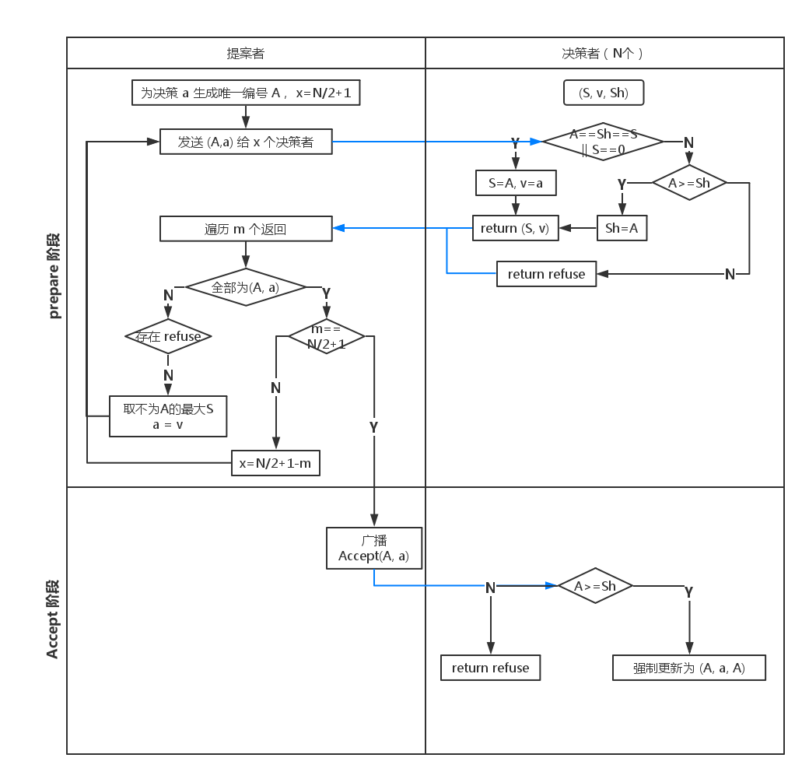
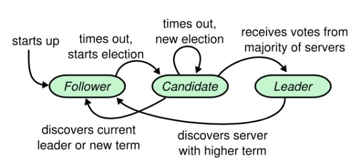
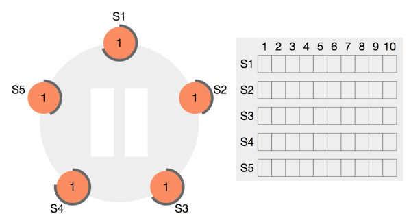
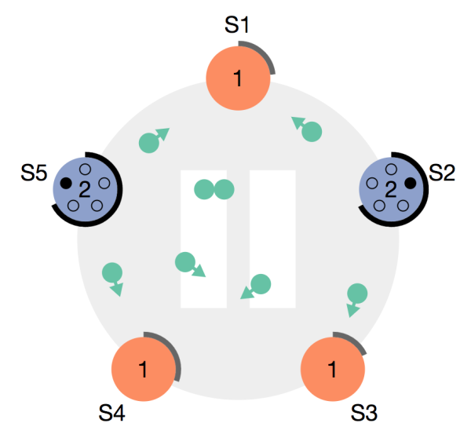
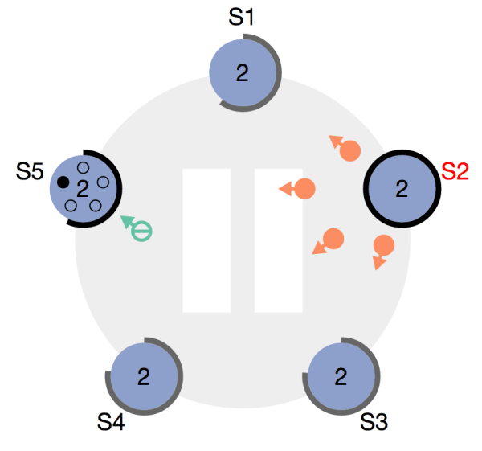
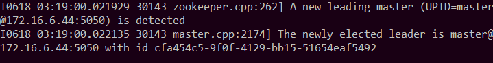
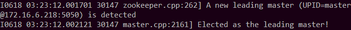

Report for Assignment 6

------

# 一、简单叙述 Paxos 算法的基本思想

Paxos 算法用于处理基于消息传递机制的分布式系统通信过程中，可能出现的一致性问题。这里，假设系统不会出现拜占庭错误（即有可能一个消息被传递了两次，但不会出现错误的消息）的情况。Paxos 是算法的设计者莱斯利·兰伯特（Leslie Lamport）提出的虚构的希腊城邦的名字，他利用城邦中议员制定法律的场景来解释本算法。

议员可能有三种身份，每人可以有多个身份：

+ proposer，负责提出法律提案，信息包括提案编号和数值。
+ acceptor，在收到提案后可以选择接受提案，若一个提案被多数 acceptor 所接受，则这一提案被批准。
+ learner，负责学习被批准的提案的数值。

算法执行中涉及到以下命题：

命题 1：如果一个编号为 n 的提案具有 value v，那么存在一个多数派，要么他们中的所有人都没有 accept 编号小于 n 的任何提案，要么他们已经 accept 的所有编号小于 n 的提案中,编号最大的那个提案具有 value v。

算法开始执行后，通过一个决议分为两个阶段：

1. prepare 阶段

+ proposer 选择一个提案编号 n，并将 prepare 请求发送给 acceptors 中数量达到多数派的一部分；
+ acceptor 在收到 prepare 消息后，如果提案的编号大于它已经回复的所有 prepare 消息，则 acceptor 将自己上次接受的提案回复给 proposer，并承诺不再回复小于 n 的提案。
+ 在任何时刻，如果一个 proposer 发现已经有其他 proposers 提出了编号更高的提案，则他应该中断正在进行的过程。因此，如果一个 acceptor 发现存在一个更高编号的提案，则需要通知 proposer，告知其中断这次提案。
2. accept 阶段

+ 当一个 proposer 收到了多数 acceptors 对 prepare 的回复后，就进入 accept 阶段。它要向回复 prepare 请求的所有 acceptors 发送 accept 请求，包括编号 n 和根据命题 1 决定的 value（如果根据命题 1，没有已经接受的 value，那么它可以自由决定一个 value）。
+ 在不违背自己向其他 proposer 的承诺的前提下，acceptor 收到 accept 请求后即接受这个请求。

在实际应用中，若某个 proposer 在 propose 阶段没有竞争者，且信息及时传达到了所有他希望传达的 acceptor 处，则过程退化为普通的二阶段提交。

若在 propose 阶段产生竞争者，所有仅收到一份提案的 acceptor 会向相应的提案发送者回复；若某个 proposer 因此而获得了多数人的赞同，他将向所有人发送信息，说明提案已经通过；若某个 acceptor 收到了多份提案，则他会根据提案接收的先后顺序或 proposer 的权重，选择向其中一个 proposer 发送接受回复，另一个发送拒绝回复。

简要的算法流程图如下：



# 二、模拟 Raft 协议工作的一个场景并叙述处理过程

Raft 一致性协议将整个通信过程分为三个阶段，leader election，log replication 和 commit。

每个 server 可能处于三个状态：leader，follower，candidate：

+ leader 为集群主节点，整个集群仅有一个 leader 节点可以存在
+ follower 为跟随节点，follower 知晓自己的 leader，并与 leader 进行通信
+ candidate 是当 follower 无法联系上 leader 节点时所转化而成，candidate 的作用是在自己无法联系上 leader 的情况下联系 leader

节点状态的转换关系约束如下：

- 集群启动时，所有节点初始化为 follower
- 节点具有 follower，candidate，leader 这样的等级队列，不能跨级别升降

具体的转换关系大致可以用下图表示：



## 工作场景模拟

1. 初始化，所有节点均为 follower



2. S2 和 S5 节点成为 candidate，对任期 +1，并向其他节点发送 vote 申请



3. vote 结束后，S2获得 4 张选票，S5 获得一张；S2 成为 leader



4. 之后，leader 会以一定的周期向 followers 发送消息，followers 进行回复。若 followers 没有接到这个消息，它会在 timeout 之后成为 candidate，并开始新的投票阶段。
5. 系统的某些部分如果产生变化，将会由 leader 通知 followers 这些变化并由 followers 回复。

# 三、Mesos 的容错机制

Mesos 包括一个运行中的 master 节点和多个备用 master 节点，由 zookeeper 进行监控。当运行中的 master 节点发生故障时，zookeeper 负责启动新 master 的选举工作。建议的节点总数是 5 个，实际上，生产环境至少需要 3 个 master 节点。 

Mesos 将 master 设计为持有软件状态，这意味着当 master 节点发生故障时，其状态可以很快地在新选举的 master 节点上重建。 Mesos 的状态信息实际上驻留在Framework 调度器和 Slave 节点集合之中。当一个新的 master 当选后，zookeeper 会通知 Framework 和选举后的 Slave 节点集合，使其在新的 master 上被注册。彼时，新的 master 可以根据 Framework 和 Slave 节点集合发送过来的信息，重建内部状态。

如果 slave 或 executor 出错，mesos 会将错误信息提交给相应的 scheduler 进行处理；而如果 scheduler 出错，master 将会通知同一个 framework 注册的其他 scheduler 继续进行工作。

## 验证容错机制

安装配置 zookeeper

```
wget http://mirror.nexcess.net/apache/zookeeper/stable/zookeeper-3.4.10.tar.gz
tar -zxf zookeeper-3.4.10.tar.gz
```

分别修改三台主机的 zookeeper 配置文件

```
cd zookeeper-3.4.10/
cd conf/
cp zoo_sample.cfg zoo.cfg

vim zoo.cfg

# 修改dataDir一项
dataDir=/var/lib/zookeeper

# 添加master server信息
server1=172.16.6.44:2888:3888
server2=172.16.6.218:2888:3888
server3=172.16.6.231:2888:3888
```

在三台主机的 ```/var/lib/zookeeper/``` 目录下创建 ```myid``` 文件，分别写入 1、2 或 3

```
sudo su
#1000
root@oo-lab:/home/pkusei/zookeeper-3.4.10# mkdir /var/lib/zookeeper
root@oo-lab:/home/pkusei/zookeeper-3.4.10# echo "1" > /var/lib/zookeeper/myid
#1001
root@oo-lab:/home/pkusei/zookeeper-3.4.10# mkdir /var/lib/zookeeper
root@oo-lab:/home/pkusei/zookeeper-3.4.10# echo "2" > /var/lib/zookeeper/myid
#1002
root@oo-lab:/home/pkusei/zookeeper-3.4.10# mkdir /var/lib/zookeeper
root@oo-lab:/home/pkusei/zookeeper-3.4.10# echo "3" > /var/lib/zookeeper/myid
```

分别启动 master

```
mesos master --zk=zk://172.16.6.44:2181,172.16.6.218:2181,172.16.6.231:2181/mesos --quorum=2 --ip=172.16.6.44  --hostname=mas1 --work_dir=/var/lib/mesos --log_dir=/var/log/mesos

mesos master --zk=zk://172.16.6.44:2181,172.16.6.218:2181,172.16.6.231:2181/mesos --quorum=2 --ip=172.16.6.218 --hostname=mas2 --work_dir=/var/lib/mesos --log_dir=/var/log/mesos

mesos master --zk=zk://172.16.6.44:2181,172.16.6.218:2181,172.16.6.231:2181/mesos --quorum=2 --ip=172.16.6.231 --hostname=mas3 --work_dir=/var/lib/mesos --log_dir=/var/log/mesos
```

在日志中可以看到选举信息，发现 1000 主机被选举为 master



如果 kill 掉 1000 主机的 master 进程，将在 1001 主机中看到如下信息



这表明 1001 主机被选举为了新的 master

# 综合作业

整体思路：

1. 启动 mesos 集群
2. 设计 docker 容器的入口程序以启动和维护 etcd 集群，并完成要求的部分功能
3. 通过 GlusterFS 进行分布式存储的创建和管理
4. 编写 Dockerfile 制作镜像
5. 设置代理
6. 启动 python scheduler

## Mesos 集群的启动

与上一部分基本相同，在三台主机上分别启动一个 master 和一个 agent：

```
mesos master --zk=zk://172.16.6.44:2181,172.16.6.218:2181,172.16.6.231:2181/mesos --quorum=2 --ip=172.16.6.44 --port=7070 --cluster=mesos_with_zookeeper --hostname=162.105.174.38 --work_dir=/var/lib/mesos --log_dir=/var/log/mesos > master.log 2>&1

mesos master --zk=zk://172.16.6.44:2181,172.16.6.218:2181,172.16.6.231:2181/mesos --quorum=2 --ip=172.16.6.218 --port=7070 --cluster=mesos_with_zookeeper --hostname=162.105.174.38 --work_dir=/var/lib/mesos --log_dir=/var/log/mesos > master.log 2>&1

mesos master --zk=zk://172.16.6.44:2181,172.16.6.218:2181,172.16.6.231:2181/mesos --quorum=2 --ip=172.16.6.231 --port=7070 --cluster=mesos_with_zookeeper --hostname=162.105.174.38 --work_dir=/var/lib/mesos --log_dir=/var/log/mesos > master.log 2>&1

mesos agent --master=zk://172.16.6.44:2181,172.16.6.218:2181,172.16.6.231:2181/mesos --work_dir=/var/lib/mesos --log_dir=/var/log/mesos --ip=172.16.6.44 --port=5051 --hostname=162.105.174.38 --containerizers=docker,mesos --image_providers=docker --isolation=docker/runtime > agent.log 2>&1

mesos agent --master=zk://172.16.6.44:2181,172.16.6.218:2181,172.16.6.231:2181/mesos --work_dir=/var/lib/mesos --log_dir=/var/log/mesos --ip=172.16.6.218 --port=5052 --hostname=162.105.174.38 --containerizers=docker,mesos --image_providers=docker --isolation=docker/runtime > agent.log 2>&1

mesos agent --master=zk://172.16.6.44:2181,172.16.6.218:2181,172.16.6.231:2181/mesos --work_dir=/var/lib/mesos --log_dir=/var/log/mesos --ip=172.16.6.231 --port=5053 --hostname=162.105.174.38 --containerizers=docker,mesos --image_providers=docker --isolation=docker/runtime > agent.log 2>&1
```

## 入口程序

这一部分主要完成以下任务：

主函数中维护整个集群的 hosts 表。函数中使用循环结构不断监测本机在集群中的状况。如果成为 leader，则启动 jupyter notebook 并维护 kv 对，否则本机为 follower，则继续创建 kv 对：

```python
def main():

    start_ssh()
    start_etcd(ip_addr)

    leader_flag = 0
    watch_flag = 0
    stats_url = 'http://127.0.0.1:2379/v2/stats/self'
    stats_request = urllib.request.Request(stats_url)
    f = os.popen("ifconfig cali0 | grep 'inet addr' | cut -d ':' -f 2 | cut -d ' ' -f 1")
    ip_addr = f.read().strip('\n')
    while True:
        try:
            stats_reponse = urllib.request.urlopen(stats_request)
        except urllib.error.URLError as e:
            print('[WARN] ', e.reason)
            print('[WARN] Wating for etcd')

        else:
            if watch_flag == 0:
                watch_flag = 1
                watch_dog(ip_addr)

            stats_json = stats_reponse.read().decode('utf-8')
            data = json.loads(stats_json)


            if data['state'] == 'StateLeader':
                if leader_flag == 0:
                    leader_flag = 1

                    args = ['/usr/local/bin/jupyter', 'notebook', '--NotebookApp.token=', '--ip=0.0.0.0', '--port=8888']
                    subprocess.Popen(args)

                    os.system('/usr/local/bin/etcdctl rm /hosts')
                    os.system('/usr/local/bin/etcdctl mk /hosts/0' + ip_addr + ' ' + ip_addr)
                    os.system('/usr/local/bin/etcdctl updatedir --ttl 30 /hosts')
                else:
                    os.system('/usr/local/bin/etcdctl mk /hosts/0' + ip_addr + ' ' + ip_addr)


            elif data['state'] == 'StateFollower':
                leader_flag = 0
                os.system('/usr/local/bin/etcdctl mk /hosts/' + ip_addr + ' ' + ip_addr)

        time.sleep(1)
```

etcd 集群的创建，共包括五个节点：

```python
def start_etcd(ip_addr):

    args = ['/usr/local/bin/etcd', '--name', 'node' + ip_addr[-1], \
    '--data-dir', '/var/lib/etcd', \
    '--initial-advertise-peer-urls', 'http://' + ip_addr + ':2380', \
    '--listen-peer-urls', 'http://' + ip_addr + ':2380', \
    '--listen-client-urls', 'http://' + ip_addr + ':2379,http://127.0.0.1:2379', \
    '--advertise-client-urls', 'http://' + ip_addr + ':2379', \
    '--initial-cluster-token', 'b6', \
    '--initial-cluster', 'node0=http://192.168.0.100:2380,node1=http://192.168.0.101:2380,node2=http://192.168.0.102:2380,node3=http://192.168.0.103:2380,node4=http://192.168.0.104:2380', \
    '--initial-cluster-state', 'new']
    subprocess.Popen(args)
```

定义 watcher 函数用来引入 daemon 在后台监控并维护 hosts 更新情况：

```python
def watcher(ip_addr):
    args = ['/usr/local/bin/etcdctl', 'exec-watch', '--recursive', '/hosts', '--', '/usr/bin/python3', '/home/admin/code/watch.py', ip_addr]
    subprocess.Popen(args)
```

在 daemon 中设置更新 hosts 创建时间、更新信息和 kv 对信息的语句

```python
def main(ip_addr):
    action = os.getenv('ETCD_WATCH_ACTION')

    stats_json = stats_reponse.read().decode('utf-8')
    
    stats_request = urllib.request.Request(stats_url)
    stats_reponse = urllib.request.urlopen(stats_request)
    
    data = json.loads(stats_json)
    stats_url = 'http://127.0.0.1:2379/v2/stats/self'

    print('[INFO] Processing', action)

    if action == 'expire':
        if data['state'] == 'StateLeader':
            os.system('/usr/local/bin/etcdctl mk /hosts/0' + ip_addr + ' ' + ip_addr)
            os.system('/usr/local/bin/etcdctl updatedir --ttl 30 /hosts')

    elif action == 'create':
        edit_hosts()
        if data['state'] == 'StateFollower':
            os.system('/usr/local/bin/etcdctl mk /hosts/' + ip_addr + ' ' + ip_addr)

if __name__ == '__main__':
    main(sys.argv[1])
```

## 分布式存储系统的部署

按照第四次作业的思路，更改三台主机的 hosts：

```
$ vim /etc/hosts
#1000 as an example
127.0.0.1       server1 localhost
127.0.1.1       oo-lab.cs1cloud.internal        oo-lab
172.16.6.218    server2
172.16.6.231    server3
```

在三台服务器上分别创建存储砖

```
$ mkdir -p /data/brick1
```

在 1000 上创建并启动 volume（```force``` 的目的是强制允许 GlusterFS 在 root 分区存储数据）

```
$ gluster volume create volume1 replica 2 server1:/data/brick1 server2:/data/brick1 force
$ gluster volume start volume1
$ gluster volume info
```

在三台主机上分别创建挂载点，挂载 b6_volume

```
# create the mount point and mount volume1
mkdir -p /storage
mount -t glusterfs server1:/b6_volume /storage
```

### 实现 ssh 免密码登陆

用 ```ssh-keygen``` 命令生成公私钥并放置在共享文件系统中

```
ssh-keygen -f /home/admin/.ssh/id_rsa -t rsa && cat /home/admin/.ssh/id_rsa.pub >> /home/admin/gfsVolume/authorized_keys && /etc/init.d/ssh start
```

## 用 Dockerfile 制作镜像

```
FROM ubuntu:latest

RUN apt update && apt install -y sudo python3-pip ssh net-tools curl vim
RUN pip3 install --upgrade pip && pip3 install jupyter

RUN useradd -ms /bin/bash admin && adduser admin sudo && echo 'admin:admin' | chpasswd
RUN mkdir /home/admin/first_folder

RUN wget -P /root https://github.com/coreos/etcd/releases/download/v3.1.7/etcd-v3.1.7-linux-amd64.tar.gz && tar -zxf /root/etcd-v3.1.7-linux-amd64.tar.gz -C /root
RUN ln -s /root/etcd-v3.1.7-linux-amd64/etcd /usr/local/bin/etcd && ln -s /root/etcd-v3.1.7-linux-amd64/etcdctl /usr/local/bin/etcdctl

RUN mkdir /var/run/sshd
RUN echo 'AuthorizedKeysFile /ssh_info/authorized_keys' >> /etc/ssh/sshd_config

RUN echo 'The cluster has 5 containers which are "192.168.0.100", "192.168.0.101", "192.168.0.102", "192.168.0.103" and "192.168.0.104". The hostname of each node is "cluster-X". The password is "admin" for user "admin" by default.\n' > /home/admin/README

ADD code/ /home/admin/code/
RUN mkdir /home/admin/shared_folder

CMD ["/usr/bin/python3", "/home/admin/code/start.py"]
```

生成镜像

```
docker build -t b6_image .
```

分别在 root 下启动五个 etcd 节点

```
docker run -d --net my_net --ip 192.168.0.100 -v /home/pkusei/b6/docker:/ssh_info \
-v /home/pkusei/b6/js:/home/admin/shared_folder --hostname cluster \
--name node0 b6_image

docker run -d --net my_net --ip 192.168.0.101 -v /home/pkusei/b6/docker:/ssh_info \
-v /home/pkusei/b6/js:/home/admin/shared_folder --hostname cluster \
--name node1 b6_image

docker run -d --net my_net --ip 192.168.0.102 -v /home/pkusei/b6/docker:/ssh_info \
-v /home/pkusei/b6/js:/home/admin/shared_folder --hostname cluster \
--name node2 b6_image

docker run -d --net my_net --ip 192.168.0.103 -v /home/pkusei/b6/docker:/ssh_info \
-v /home/pkusei/b6/js:/home/admin/shared_folder --hostname cluster \
--name node3 b6_image

docker run -d --net my_net --ip 192.168.0.104 -v /home/pkusei/b6/docker:/ssh_info \
-v /home/pkusei/b6/js:/home/admin/shared_folder --hostname cluster \
--name node4 b6_image
```

## scheduler

在第五次作业的 scheduler 基础上进行修改，主要扩展了维护共享文件卷和网络的语句，摘录如下：

```python
	ip = Dict()
	ip.key = 'ip'
	ip.value = '192.168.0.10' + str(self.launched_task)

	volume1 = Dict()
	volume1.key = 'volume'
	volume1.value = '/home/pkusei/b6/docker:/ssh_info'

	volume2 = Dict()
	volume2.key = 'volume'
	volume2.value = '/home/pkusei/b6/js:/home/admin/shared_folder'

	NetworkInfo = Dict()
	NetworkInfo.name = 'my_net'
    
    hostname = Dict()
	hostname.key = 'hostname'
	hostname.value = 'cluster'

	DockerInfo = Dict()
	DockerInfo.image = 'b6_image'
	DockerInfo.network = 'USER'
	DockerInfo.parameters = [ip, hostname, volume1, volume2]

	ContainerInfo = Dict()
	ContainerInfo.type = 'DOCKER'
	ContainerInfo.docker = DockerInfo
	ContainerInfo.network_infos = [NetworkInfo]
```


利用以下命令启动 scheduler：

```
python scheduler.py 172.16.6.44 > scheduler.log 2>&1
```